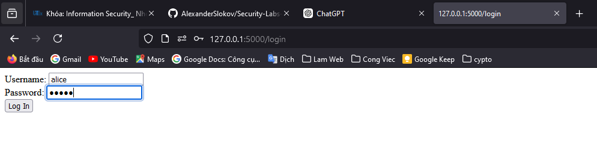
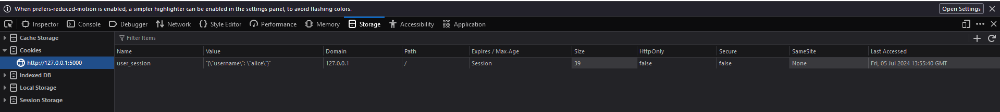

# 20110357, Dinh Tan Dung
### Task 1: Normal Transaction with CSRF Vulnerability

#### 1.1: Login, Check Balance

1. **Login as Alice:**
    - Open a web browser and navigate to `http://localhost:5000/login`.
    - Enter the username `alice` and password `alice`.

    - Submit the form to log in. The server will set a session cookie for `alice`.

2. **Check Alice's Balance:**
    - Navigate to `http://localhost:5000/balance`.
    - The server will retrieve Alice's balance from the `user_accounts` dictionary and display it. Alice's initial balance should be $10,000.

#### 1.2: Doing the Transaction

1. **Transfer Money from Alice to Bob:**
    - Navigate to `http://localhost:5000/transfer`.
    - Enter `bob` as the recipient account and an amount (e.g., $1000).
    - Submit the form to perform the transfer.
    - The server will deduct the amount from Alice's balance and add it to Bob's balance.
    - Check the balance again to verify the transaction.

#### 1.3: Transfer Money Illegitimately

1. **Load the Malicious Form (hidden_form.html):**
    - Assume Alice is tricked into loading `hidden_form.html` (e.g., via a phishing email or a malicious website).
    - When `hidden_form.html` is loaded, the form is automatically submitted to `http://localhost:5000/transfer` with the recipient account set to `attacker` and the amount set to $1000.

2. **Verify the Illegitimate Transfer:**
    - Check Alice's balance again by navigating to `http://localhost:5000/balance`. The balance should have decreased by $1000.
    - Check the attacker's balance to confirm that the amount has been added to their account.

### Task 2: CSRF Countermeasure Implementation

#### 2.1: Solution 1: CSRF Token

To prevent CSRF attacks, one effective measure is to use a CSRF token. This token is a unique value generated by the server and included in each form. The server validates this token when the form is submitted to ensure that the request is legitimate.

1. **Generate CSRF Token:**
    - Modify the `get_session_data` function to include a CSRF token:
        ```python
        import uuid
        
        def get_session_data():
            session_cookie = request.cookies.get('user_session')
            if session_cookie:
                session_data = json.loads(session_cookie)
                if 'csrf_token' not in session_data:
                    session_data['csrf_token'] = str(uuid.uuid4())
                    response = make_response()
                    response.set_cookie('user_session', json.dumps(session_data))
                    return session_data, response
                return session_data, None
            return None, None
        ```

2. **Include CSRF Token in Forms:**
    - Modify the `transfer` route to include the CSRF token in the form:
        ```python
        @app.route('/transfer', methods=['GET', 'POST'])
        def transfer():
            session_data, response = get_session_data()
            if not session_data:
                return "Please log in first", 401
            
            if request.method == 'POST':
                csrf_token = request.form['csrf_token']
                if csrf_token != session_data['csrf_token']:
                    return "Invalid CSRF token", 403
                
                from_account = session_data['username']
                to_account = request.form['to']
                amount = int(request.form['amount'])
                
                if to_account not in user_accounts:
                    return "Recipient account does not exist", 400
                if amount <= 0:
                    return "Invalid amount", 400
                if user_accounts[from_account]['balance'] < amount:
                    return "Insufficient funds", 400
                
                user_accounts[from_account]['balance'] -= amount
                user_accounts[to_account]['balance'] += amount
                
                return f"Transferred ${amount} to account {to_account}"
            
            csrf_token = session_data['csrf_token']
            form_html = f'''
                <form method="post">
                    To account: <input type="text" name="to"><br>
                    Amount: <input type="number" name="amount"><br>
                    <input type="hidden" name="csrf_token" value="{csrf_token}">
                    <input type="submit" value="Transfer">
                </form>
            '''
            return form_html
        ```

3. **Validate CSRF Token:**
    - The server will check the CSRF token in the form submission to ensure it matches the one stored in the session. If the tokens do not match, the request is denied.

#### 2.2: Solution 2: SameSite Cookies

Another measure to prevent CSRF attacks is to set the `SameSite` attribute for cookies. This attribute instructs the browser not to send the cookie along with cross-site requests.

1. **Set SameSite Attribute for Cookies:**
    - Modify the `login` and `logout` routes to set the `SameSite` attribute:
        ```python
        from flask import make_response

        @app.route('/login', methods=['GET', 'POST'])
        def login():
            if request.method == 'POST':
                username = request.form['username']
                password = request.form['password']
                if username in user_accounts and user_accounts[username]['password'] == password:
                    resp = make_response(f"Logged in as {username}")
                    resp.set_cookie('user_session', json.dumps({'username': username}), samesite='Strict')
                    return resp
                else:
                    return "Invalid credentials", 401
            return '''
                <form method="post">
                    Username: <input type="text" name="username"><br>
                    Password: <input type="password" name="password"><br>
                    <input type="submit" value="Log In">
                </form>
            '''

        @app.route('/logout')
        def logout():
            resp = make_response("Logged out")
            resp.set_cookie('user_session', '', expires=0, samesite='Strict')
            return resp
        ```

2. **Test the Countermeasures:**
    - Repeat the steps in Task 1 to verify that the CSRF attacks are now prevented by the implemented countermeasures.

By following these steps, you can effectively mitigate CSRF vulnerabilities and enhance the security of your web application.
