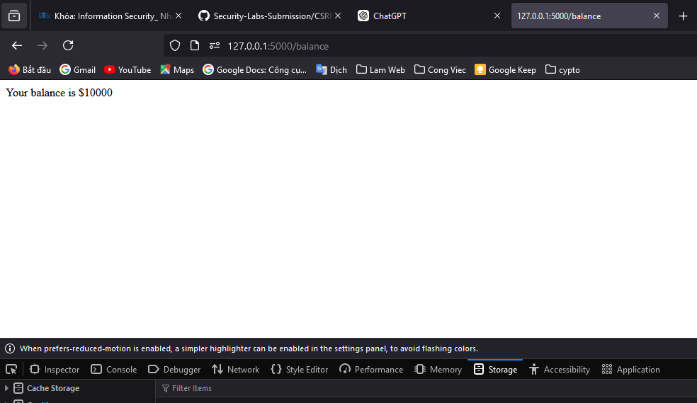
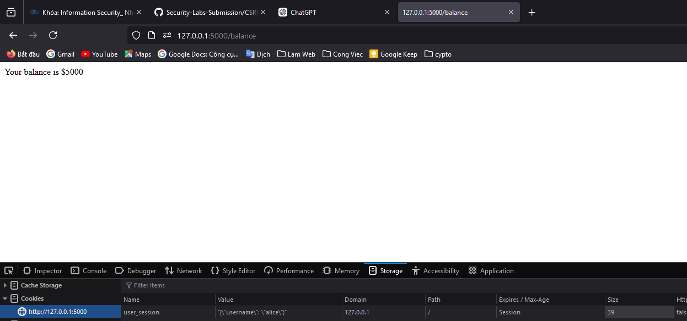

# 20110357, Dinh Tan Dung

### Task 1: Normal Transaction with CSRF Vulnerability
#### 1.1: Login, Check Balance

1. **Login as Alice:**
    - Open a web browser and navigate to `http://localhost:5000/login`.
    - Enter the username `alice` and password `alice`.
   
    
    - Submit the form to log in. The server will set a session cookie for `alice` as we can see it on the Storage cookie.
   
    

2. **Check Alice's Balance:**
    - Navigate to `http://localhost:5000/balance`.
    - The server will retrieve Alice's balance from the `user_accounts` dictionary and display it. Alice's initial balance should be $10,000.
    
    

#### 1.2: Doing the Transaction

1. **Transfer Money from Alice to Bob:**
    - Navigate to `http://localhost:5000/transfer`.
   
    
    - Enter `bob` as the recipient account and an amount (e.g., $1000).
    - Submit the form to perform the transfer.
   
    
    - The server will deduct the amount from Alice's balance and add it to Bob's balance.
    
       

#### 1.3: Transfer Money Illegitimately

1. **Load hidden form (hidden_form.html)**:
    - Open the file `hidden_form.html` in the browser by navigating to the file path `hidden_form.html` on the computer. We simply assumed that Alice was being phished and mistakenly clicked on this fraudulent website.
    
    - When the page is loaded, the form will automatically submit and perform an illegal money transfer from Alice's account to the attacker's account.
    

2. **Check for illegal transactions**:
    - Check Alice's balance again by navigating to `http://localhost:5000/balance`. Here, I made another legitimate money transfer of $2000, and the phishing attempt robbed Alice of another $1000, so Alice only had $2000 left.
    
    - Confirm attacker's balance.

### Task 2: CSRF Countermeasure Implementation

#### 2.1: Solution 1: CSRF Token

To prevent CSRF attacks, one effective measure is to use a CSRF token. This token is a unique value generated by the server and included in each form. The server validates this token when the form is submitted to ensure that the request is legitimate.

1. **Generate CSRF Token:**
    - Modify the `get_session_data` function to include a CSRF token:
   
    
    - Let's take a closer look at what this function does:
    ```python
    import uuid
    
    def get_session_data():
        session_cookie = request.cookies.get('user_session')
        if session_cookie:
            session_data = json.loads(session_cookie)
            if 'csrf_token' not in session_data:
                session_data['csrf_token'] = str(uuid.uuid4())
                response = make_response()
                response.set_cookie('user_session', json.dumps(session_data))
                return session_data, response
            return session_data, None
        return None, None
    ```
    - When a user logs in or starts a session, a unique CSRF token is generated using `uuid.uuid4()`. This token is then stored in the user's session data.
    ```python
    session_data['csrf_token'] = str(uuid.uuid4())
    ```

2. **Including CSRF Token in Forms**

    We updated the `transfer` route to include the CSRF token in the form as a hidden field. This ensures that every form submission includes the token.

    ```python
    @app.route('/transfer', methods=['GET', 'POST'])
    def transfer():
        session_data, response = get_session_data()
        if not session_data:
            return "Please log in first", 401

        if request.method == 'POST':
            csrf_token = request.form['csrf_token']
            if csrf_token != session_data['csrf_token']:
                return "Invalid CSRF token", 403

            from_account = session_data['username']
            to_account = request.form['to']
            amount = int(request.form['amount'])

            if to_account not in user_accounts:
                return "Recipient account does not exist", 400
            if amount <= 0:
                return "Invalid amount", 400
            if user_accounts[from_account]['balance'] < amount:
                return "Insufficient funds", 400

            user_accounts[from_account]['balance'] -= amount
            user_accounts[to_account]['balance'] += amount

            return f"Transferred ${amount} to account {to_account}"

        csrf_token = session_data['csrf_token']
        form_html = f'''
            <form method="post">
                To account: <input type="text" name="to"><br>
                Amount: <input type="number" name="amount"><br>
                <input type="hidden" name="csrf_token" value="{csrf_token}">
                <input type="submit" value="Transfer">
            </form>
        '''
        return form_html
    ```

3. **Verifying the CSRF Token**

    When the form is submitted, the server checks if the CSRF token sent in the form matches the token stored in the session. If the tokens do not match, the request is denied with a 403 error.

    ```python
    if request.method == 'POST':
        csrf_token = request.form['csrf_token']
        if csrf_token != session_data['csrf_token']:
            return "Invalid CSRF token", 403
    ```

4. **Testing the solution**

    - First, we logged in as Alice:
   
    
    - And we have $10,000 in the balance:
   
    
    - Now we will make a normal transfer for $5,000, as shown:
   
    
    - And we recheck to make sure that the transfer could perform fully:
   
    
    - Then, we should not be able to perform a CSRF attack by opening the `hidden_form.html`.
    
   
    - But something went wrong with the attack file, that is because the CSRF token was not included in the form submission for the `/transfer` route. This led to a `BadRequestKeyError` because the server expected a CSRF token to be present in the form data. Meanwhile, the account Alice had a CSRF token:
    
   
    - So, I did some modification to the attacking file:
    ```html
    <!DOCTYPE html>
    <html>
    <body>
    <h1>Win a Prize!</h1>
    <form id="csrf-form" action="http://localhost:5000/transfer" method="POST" style="display:none;">
        <input type="hidden" name="to" value="attacker">
        <input type="hidden" name="amount" value="1000">
        <input type="hidden" name="csrf_token" value="{{ csrf_token }}">
    </form>

    <script>
        window.onload = function() {
            document.getElementById("csrf-form").submit();
        }
    </script>
    </body>
    </html>
    ```
    - Since `hidden_form.html` is supposed to simulate a malicious form, it wouldn’t typically have access to the CSRF token. By adding CSRF token checks in the `transfer` route, we ensure that any form without a valid CSRF token (like `hidden_form.html`) is blocked from performing unauthorized actions.
    
   

#### 2.2: Solution 2: SameSite Cookies

Another measure to prevent CSRF attacks is to set the `SameSite` attribute for cookies. This attribute instructs the browser not to send the cookie along with cross-site requests.

1. **Set SameSite Attribute for Cookies:**
    - Modify the `login` and `logout` routes to set the `SameSite` attribute:
    ```python
    from flask import make_response

    @app.route('/login', methods=['GET', 'POST'])
    def login():
        if request.method == 'POST':
            username = request.form['username']
            password = request.form['password']
            if username in user_accounts and user_accounts[username]['password'] == password:
                resp = make_response(f"Logged in as {username}")
                resp.set_cookie('user_session', json.dumps({'username': username}), samesite='Strict')
                return resp
            else:
                return "Invalid credentials", 401
        return '''
            <form method="post">
                Username: <input type="text" name="username"><br>
                Password

: <input type="password" name="password"><br>
                <input type="submit" value="Log In">
            </form>
        '''

    @app.route('/logout')
    def logout():
        resp = make_response("Logged out")
        resp.set_cookie('user_session', '', expires=0, samesite='Strict')
        return resp
    ```

2. **Test the Countermeasures:**
    - Repeat the steps in Task 1 to verify that the CSRF attacks are now prevented by the implemented countermeasures.

By following these steps, you can effectively mitigate CSRF vulnerabilities and enhance the security of your web application.
