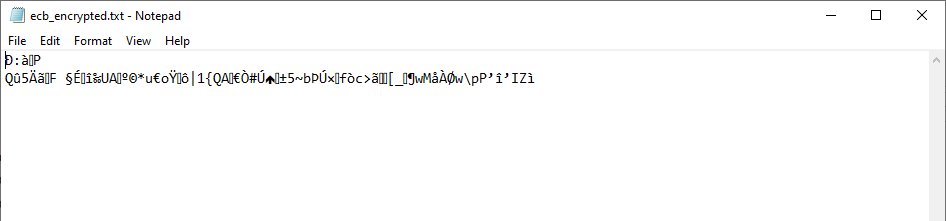
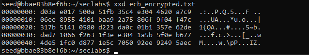
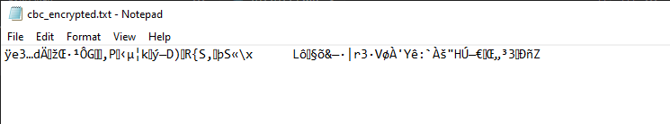
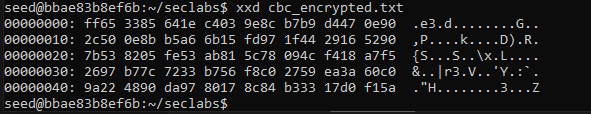
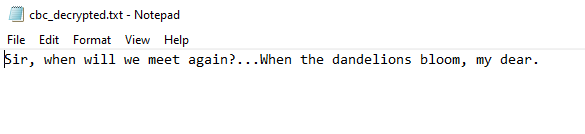
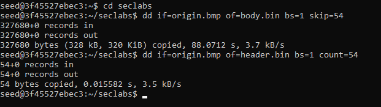
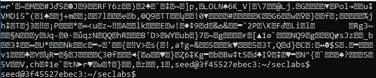
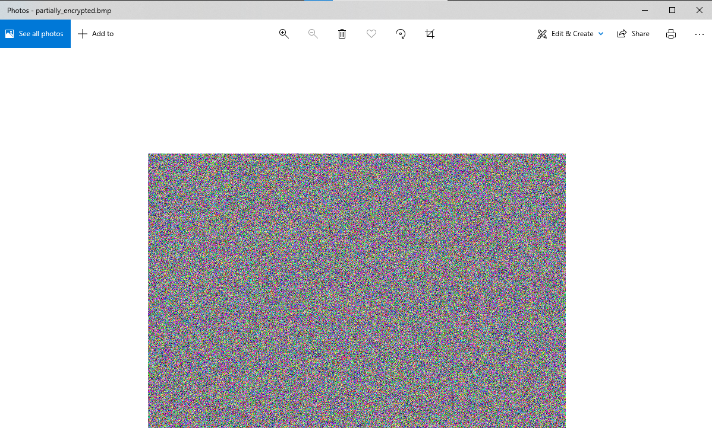
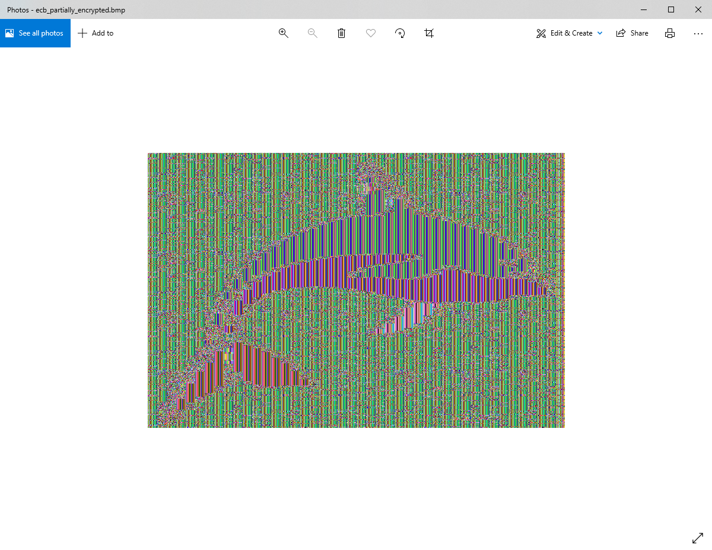

# 20110357, Dinh Tan Dung
# Task 1: Encrypt and Decrypt Text file

encryptingLargeMessage

## 1. Create a text file named `plain.txt`:
*First, we write a message and save it in a text file:*<br>

```sh
echo "Sir, when will we meet again?...When the dandelions bloom, my dear." > plain.txt
```
    
<br>


## 2. Encrypt the file using AES-256 in ECB mode:

```sh
openssl enc -aes-256-ecb -nosalt -in plain.txt -out ecb_encrypted.txt -K 00112233445566778899AABBCCDDEEFF00112233445566778899AABBCCDDEEFF
``` 

<br>

## 3. View the encrypted file using `xxd`:

```sh
xxd ecb_encrypted.txt
```

<br>

## 4. Decrypt the file:

```sh
openssl enc -d -aes-256-ecb -nosalt -in ecb_encrypted.txt -out ecb_decrypted.txt -K 00112233445566778899AABBCCDDEEFF00112233445566778899AABBCCDDEEFF
```

<br>

## 5. **For CBC mode**:

- Encrypt:

```sh
openssl enc -aes-256-cbc -nosalt -in plain.txt -out cbc_encrypted.txt -K 00112233445566778899AABBCCDDEEFF00112233445566778899AABBCCDDEEFF -iv 0102030405060708090A0B0C0D0E0F10
```

<br>

<br>

- Decrypt:

```sh
openssl enc -d -aes-256-cbc -nosalt -in cbc_encrypted.txt -out cbc_decrypted.txt -K 00112233445566778899AABBCCDDEEFF00112233445566778899AABBCCDDEEFF -iv 0102030405060708090A0B0C0D0E0F10
```

<br>

# 4.2. Encryption Mode – ECB vs. CBC

## 1. Download the bitmap file `origin.bmp`.

<br>


## 2. Split the file into header and body:

```sh
dd if=origin.bmp of=header.bin bs=1 count=54
dd if=origin.bmp of=body.bin bs=1 skip=54
```

<br>


## 3. Encrypt the body using CBC mode:

<span>*I reused the KEY and IV values from the first task, just to make sure the consistency.*</span><br>

```sh
openssl enc -aes-256-cbc -nosalt -in body.bin -out encrypted_body.bin -K 00112233445566778899AABBCCDDEEFF00112233445566778899AABBCCDDEEFF -iv 0102030405060708090A0B0C0D0E0F10
```

<span>*After using the `cat` command to look at the `encrypted_body.bin`, we can see it was fully encrypted.*</span><br>

<br>

## 4. Combine the header and encrypted body:

   ```sh
   cat header.bin encrypted_body.bin > partially_encrypted.bmp
   ```

<br>

## 5. Encrypt the body using ECB mode:

```sh
openssl enc -aes-256-ecb -nosalt -in body.bin -out ecb_encrypted_body.bin -K 00112233445566778899AABBCCDDEEFF00112233445566778899AABBCCDDEEFF
```

## 6. Re-combine the header and encrypted body encrypted by ECB:

   ```sh
   cat header.bin ecb_encrypted_body.bin > ecb_partially_encrypted.bmp
   ```

<br>

## 7. View the encrypted picture using any picture viewing software:

<span>*Explain your observations about the differences between ECB modes encrypted picture:*</span><br>

<br>

<span>*With the one encrypted by CBC modes.*</span><br>

<br>

<span>
If you compare the encrypted images:

- **ECB Encrypted Image:**
  - Visible patterns of the whale.
  - Structure of the image gives clues about the original content.
  - Less effective at hiding information.

- **CBC Encrypted Image:**
  - The image appears as complete random noise.
  - No patterns or structure from the original image.
  - Hiding the original content due to the chaining process and the use of IV.
</span><br>

# 4.3. Encryption Mode – Corrupted Cipher Text

## 1. Create a text file that is at least 64 bytes long:
   ```sh
   echo "This is a test file that is definitely longer than 64 bytes. It is used for encryption mode testing." > testfile.txt
   ```

<br>

## 2. Encrypt the file using AES-256:
   ```sh
   openssl enc -aes-256-cbc -nosalt -in testfile.txt -out encrypted_testfile.txt -K 00112233445566778899AABBCCDDEEFF00112233445566778899AABBCCDDEEFF -iv 0102030405060708090A0B0C0D0E0F10
   ```

<br>

## 3. Corrupt a bit of the 5th byte in the encrypted file:
   ```sh
   printf '\x00' | dd of=encrypted_testfile.txt bs=1 seek=4 count=1 conv=notrunc
   ```

<br>

## 4. **Decrypt the corrupted file**:
   ```sh
   openssl enc -d -aes-256-cbc -nosalt -in encrypted_testfile.txt -out decrypted_testfile.txt -K 00112233445566778899AABBCCDDEEFF00112233445566778899AABBCCDDEEFF -iv 0102030405060708090A0B0C0D0E0F10
   ```
<br>

## 5. Answer the questions:
   - **Information Recovery**: How much information can you recover by decrypting the corrupted file for each mode (ECB, CBC, CFB, OFB)?
   - **Explanation**: Explain the differences in recovery for each mode.
   - **Implications**: Discuss the implications of these differences.

<br>
