# 20110357, Dinh Tan Dung
# Task 1: Encrypt and Decrypt Text file
## 1. Create a text file named `plain.txt`:
*First, we write a message and save it in a text file:*<br>

```sh
echo "Sir, when will we meet again?...When the dandelions bloom, my dear." > plain.txt
```
    
<br>


## 2. Encrypt the file using AES-256 in ECB mode:

```sh
openssl enc -aes-256-ecb -nosalt -in plain.txt -out ecb_encrypted.txt -K 00112233445566778899AABBCCDDEEFF00112233445566778899AABBCCDDEEFF
``` 

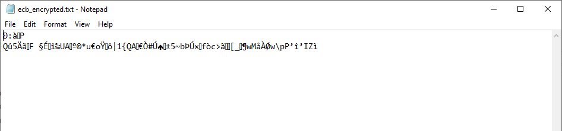<br>

## 3. View the encrypted file using `xxd`:

```sh
xxd ecb_encrypted.txt
```

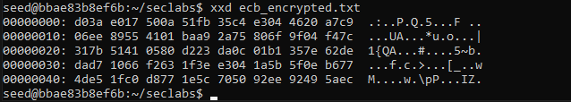<br>

## 4. Decrypt the file:

```sh
openssl enc -d -aes-256-ecb -nosalt -in ecb_encrypted.txt -out ecb_decrypted.txt -K 00112233445566778899AABBCCDDEEFF00112233445566778899AABBCCDDEEFF
```

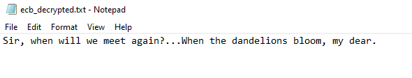<br>

## 5. **For CBC mode**:

- Encrypt:

```sh
openssl enc -aes-256-cbc -nosalt -in plain.txt -out cbc_encrypted.txt -K 00112233445566778899AABBCCDDEEFF00112233445566778899AABBCCDDEEFF -iv 0102030405060708090A0B0C0D0E0F10
```

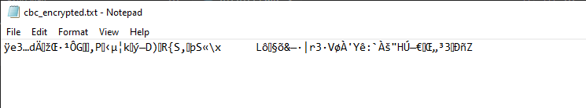<br>

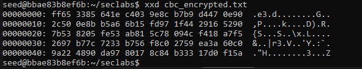<br>

- Decrypt:

```sh
openssl enc -d -aes-256-cbc -nosalt -in cbc_encrypted.txt -out cbc_decrypted.txt -K 00112233445566778899AABBCCDDEEFF00112233445566778899AABBCCDDEEFF -iv 0102030405060708090A0B0C0D0E0F10
```

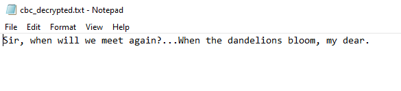<br>

# 4.2. Encryption Mode – ECB vs. CBC

## 1. Download the bitmap file `origin.bmp`.

<br>


## 2. Split the file into header and body:

```sh
dd if=origin.bmp of=header.bin bs=1 count=54
dd if=origin.bmp of=body.bin bs=1 skip=54
```

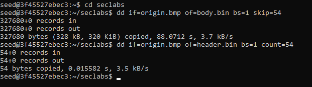<br>


## 3. Encrypt the body using CBC mode:

<span>*I reused the KEY and IV values from the first task, just to make sure the consistency.*</span><br>

```sh
openssl enc -aes-256-cbc -nosalt -in body.bin -out encrypted_body.bin -K 00112233445566778899AABBCCDDEEFF00112233445566778899AABBCCDDEEFF -iv 0102030405060708090A0B0C0D0E0F10
```

<span>*After using the `cat` command to look at the `encrypted_body.bin`, we can see it was fully encrypted.*</span><br>

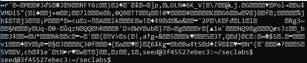<br>

## 4. Combine the header and encrypted body:

```sh
cat header.bin encrypted_body.bin > partially_encrypted.bmp
```

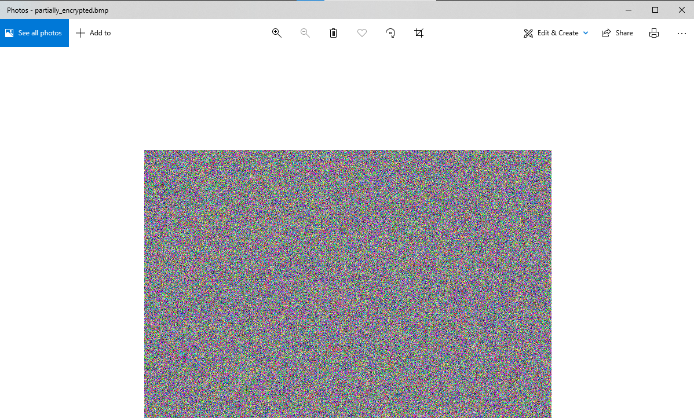<br>

## 5. Encrypt the body using ECB mode:

```sh
openssl enc -aes-256-ecb -nosalt -in body.bin -out ecb_encrypted_body.bin -K 00112233445566778899AABBCCDDEEFF00112233445566778899AABBCCDDEEFF
```

## 6. Re-combine the header and encrypted body encrypted by ECB:

```sh
cat header.bin ecb_encrypted_body.bin > ecb_partially_encrypted.bmp
```

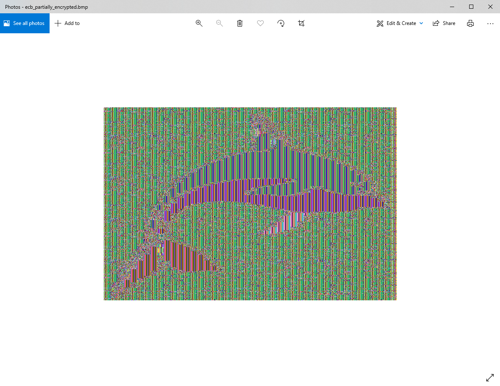<br>

## 7. View the encrypted picture using any picture viewing software:

<span>*Explain your observations about the differences between ECB modes encrypted picture:*</span><br>

<br>

<span>*With the one encrypted by CBC modes.*</span><br>

<br>

<span>If we compare the encrypted images:

- **ECB Encrypted Image:**
  - Visible patterns of the whale.
  - Structure of the image gives clues about the original content.
  - Less effective at hiding information.

- **CBC Encrypted Image:**
  - The image appears as complete random noise.
  - No patterns or structure from the original image.
  - Hiding the original content due to the chaining process and the use of IV.
</span> <br>

# 4.3. Encryption Mode – Corrupted Cipher Text

## 1. Create a text file that is at least 64 bytes long:

```sh
sudo echo "This is a test file that is definitely longer than 64 bytes. It is used for encryption mode testing." > testfile.txt
```

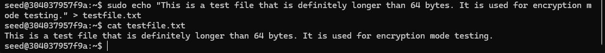<br>

## 2. Encrypt the file using AES-256-CBC:

```sh
openssl enc -aes-256-cbc -nosalt -in testfile.txt -out encrypted_testfile.txt -K 00112233445566778899AABBCCDDEEFF00112233445566778899AABBCCDDEEFF -iv 0102030405060708090A0B0C0D0E0F10
```

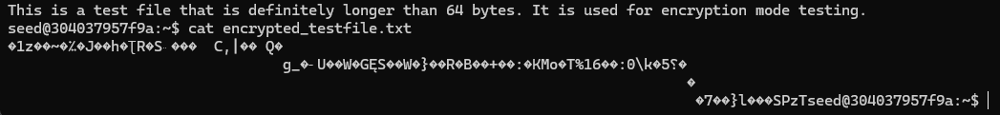<br>

## 3. Corrupt a bit of the 5th byte in the encrypted file:

   ```sh
   printf '\x00' | dd of=encrypted_testfile.txt bs=1 seek=4 count=1 conv=notrunc
   ```

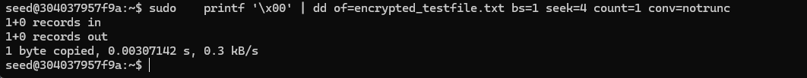<br>

## 4. **Decrypt the corrupted file**:

```sh
openssl enc -d -aes-256-cbc -nosalt -in encrypted_testfile.txt -out decrypted_testfile.txt -K 00112233445566778899AABBCCDDEEFF00112233445566778899AABBCCDDEEFF -iv 0102030405060708090A0B0C0D0E0F10
```

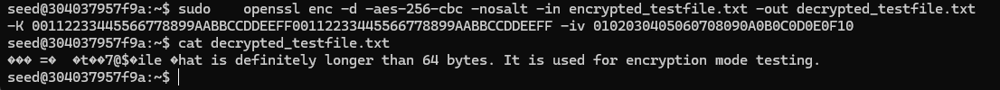<br>

<span>**Impact of Corruption**:
1. **Corrupted Byte**:
   - The `printf '\x00' | dd of=encrypted_testfile.txt bs=1 seek=4 count=1 conv=notrunc` command sets the 5th byte of the encrypted file to `\x00`. This byte is within the first block of ciphertext.

2. **Decryption of Corrupted Block**:
   - The corruption impacts the decryption of the entire first block. When the corrupted first block is decrypted, the result is incorrect.

3. **Chained Impact**:
   - The corrupted decrypted first block also affects the second block because each block in CBC mode relies on the previous ciphertext block.
   - However, subsequent blocks are decrypted correctly as they do not directly depend on the corrupted block's content but on the correct ciphertext produced.
</span><br>

## 5. Encrypt the file using AES-256-ECB and perform the same of the experiment:
```sh
   sudo echo "This is a test file that is definitely longer than 64 bytes. It is used for encryption mode testing." > testfile.txt
   
   openssl enc -aes-256-ecb -nosalt -in testfile.txt -out ecb-encrypted_testfile.txt -K 00112233445566778899AABBCCDDEEFF00112233445566778899AABBCCDDEEFF 

   sudo printf '\x00' | dd of=ecb-encrypted_testfile.txt bs=1 seek=4 count=1 conv=notrunc

   openssl enc -d -aes-256-ebc -nosalt -in ecb-encrypted_testfile.txt -out ecb_decrypted_testfile.txt -K 00112233445566778899AABBCCDDEEFF00112233445566778899AABBCCDDEEFF 

```
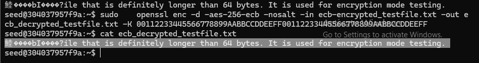 <br>

<span>*In the provided image for ECB (Electronic Codebook) mode, we can observe the following:*

- ***Visual Pattern**: The decrypted text shows that only a small portion of the text is garbled at the beginning.
Specifically, the first 16 bytes are corrupted (since AES uses 16-byte blocks).*


- ***Isolated Corruption**: The corruption in the first block does not propagate beyond this block.
The rest of the text after the first block is readable and correctly decrypted.*
</span><br>

## 6. Encrypt the file using AES-256-CFB and perform the same of the experiment:

```sh
   sudo echo "This is a test file that is definitely longer than 64 bytes. It is used for encryption mode testing." > testfile.txt
   
   openssl enc -aes-256-cfb -nosalt -in testfile.txt -out cfb-encrypted_testfile.txt -K 00112233445566778899AABBCCDDEEFF00112233445566778899AABBCCDDEEFF -iv 0102030405060708090A0B0C0D0E0F10

   sudo printf '\x00' | dd of=cfb-encrypted_testfile.txt bs=1 seek=4 count=1 conv=notrunc

   openssl enc -d -aes-256-cfb -nosalt -in cfb-encrypted_testfile.txt -out cfb_decrypted_testfile.txt -K 00112233445566778899AABBCCDDEEFF00112233445566778899AABBCCDDEEFF -iv 0102030405060708090A0B0C0D0E0F10

```

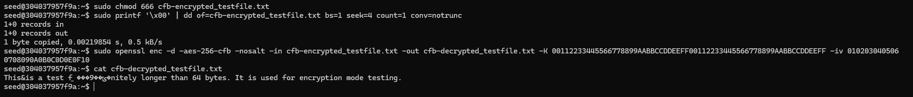<br>

<span>*In this case, I needed to modify the user's permission of the encrypted file a bit.*<br>

***Corruption Impact:***

   - *The command `printf` sets the 5th byte of the encrypted file to `\x00`, corrupting the encrypted data. This byte is part of the initial segment, causing the decryption process to produce garbled output for the corresponding plaintext segment.*
   - *In CFB mode, once the corrupted segment is processed, the decryption process can recover and correctly decrypt subsequent segments if they are not directly impacted by the corrupted ciphertext.*
</span><br>  

## 7. Implications

<span>*Each encryption mode has distinct implications for security and error handling:*

***ECB**: Fast and simple but vulnerable to pattern detection and not suitable for sensitive data.*
***CBC**: Secure against pattern detection but susceptible to error propagation, making it suitable for large, repetitive datasets.*
***CFB**: Combines the advantages of stream-like encryption and pattern obfuscation with localized error impact, ideal for real-time data encryption.*</span><br>
