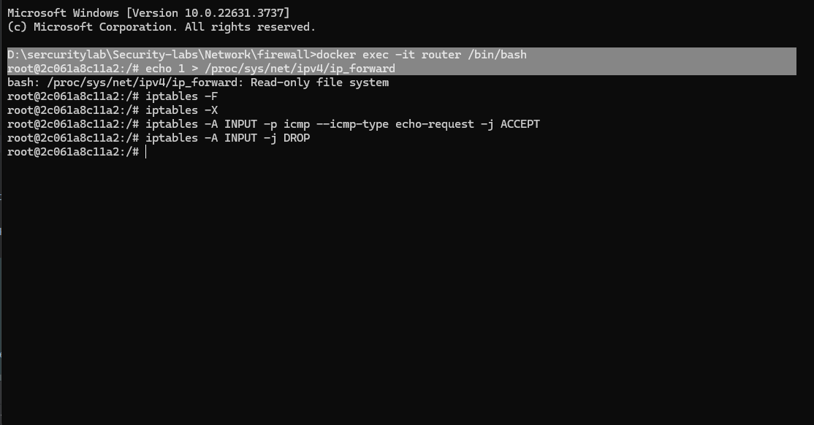
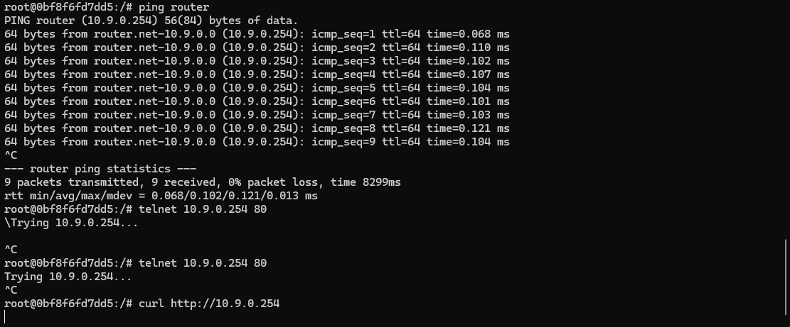

### Initial Steps:
firewallSubmission

D:\sercuritylab\Security-labs\Network\firewall>docker exec -it router /bin/bash
root@2c061a8c11a2:/# echo 1 > /proc/sys/net/ipv4/ip_forward
bash: /proc/sys/net/ipv4/ip_forward: Read-only file system
root@2c061a8c11a2:/# iptables -F
root@2c061a8c11a2:/# iptables -X
root@2c061a8c11a2:/# iptables -A INPUT -p icmp --icmp-type echo-request -j ACCEPT
root@2c061a8c11a2:/# iptables -A INPUT -j DROP
root@2c061a8c11a2:/# iptables -A FORWARD -s 10.9.0.0/24 -d 172.16.10.110 -p tcp --dport 80 -j DROP
root@2c061a8c11a2:/# iptables -A FORWARD -s 10.9.0.0/24 -d 172.16.10.110 -p tcp --dport 443 -j DROP
root@2c061a8c11a2:/# iptables -A FORWARD -s 172.16.10.0/24 -d 10.9.0.10 -p tcp --dport 80 -j DROP
root@2c061a8c11a2:/# iptables -A FORWARD -s 172.16.10.0/24 -d 10.9.0.10 -p tcp --dport 443 -j DROP
root@2c061a8c11a2:/# iptables-save > /etc/iptables/rules.v4
bash: /etc/iptables/rules.v4: No such file or directory
root@2c061a8c11a2:/#

1. **Log in to container router:**
 ```sh
 docker exec -it router /bin/bash
 ```

2. **Enable IP forwarding:**
 ```sh
 echo 1 > /proc/sys/net/ipv4/ip_forward
 ```

- 

3. **Set up `iptables` rules:**

 **a. Block all access to the router except ping:**

- We first set up the rules for the router like this to block access from all computers:
 ```sh
 # Delete old rules
 iptables -F
 iptables -X

 # Allow ping
 iptables -A INPUT -p icmp --icmp-type echo-request -j ACCEPT

 # Block all other access
 iptables -A INPUT -j DROP
 ```

When a packet arrives at the router, `iptables` checks the rules in top-down order.

- If the packet is a ping request (ICMP echo request), it will match the first rule (`iptables -A INPUT -p icmp --icmp-type echo-request -j ACCEPT`) and be accepted, Therefore, the router will respond to the ping.
- If the packet is another connection request (like `telnet` or `HTTP`), it will not match the ping rule and continue checking for further rules. It will eventually match the `DROP` rule (`iptables -A INPUT -j DROP`) and be dropped without response.

From the `outsider` and `inner`virtual computers, we will now try to connect with the router by telnet command for cross-check if we set up the router properly or not:
```sh
docker exec -it outsider-10.9.0.5 /bin/bash
telnet 10.9.0.254 80  # Thử kết nối tới cổng 80 của router (nên bị chặn)
curl http://10.9.0.254 # Thử kết nối HTTP tới router (nên bị chặn)
 ```

- As the image has shown, even the telnet or the curl commands connecting to the router, but it does not response, while we still can ping it:
- 

 **b. Prevent computers in subnet `10.9.0.0/24` from accessing the internal web server (`iweb`):**
 ```sh
 # Block access to iweb from subnet 10.9.0.0/24
 iptables -A FORWARD -s 10.9.0.0/24 -d 172.16.10.110 -p tcp --dport 80 -j DROP
 iptables -A FORWARD -s 10.9.0.0/24 -d 172.16.10.110 -p tcp --dport 443 -j DROP
 ```

 **c. Prevent computers in subnet `172.16.10.0/24` from accessing `badsite`:**
 ```sh
 # Block access to badsite from subnet 172.16.10.0/24
 iptables -A FORWARD -s 172.16.10.0/24 -d 10.9.0.10 -p tcp --dport 80 -j DROP
 iptables -A FORWARD -s 172.16.10.0/24 -d 10.9.0.10 -p tcp --dport 443 -j DROP
 ```

### Check configuration:
After setting up the `iptables` rules, test again to make sure everything works as expected.

1. **Check ping to the router from computers on the network:**
 ```sh
 docker exec -it outsider-10.9.0.5 /bin/bash
 ping 10.9.0.254 # Check from outsider
 ping 172.16.10.100 # Check from inner1
 ```

2. **Check web server access:**
 ```sh
 docker exec -it outsider-10.9.0.5 /bin/bash
 curl http://172.16.10.110 # Check for outsider access to iweb (should be blocked)

 docker exec -it inner1-172.16.10.100 /bin/bash
 curl http://10.9.0.10 # Check access from inner1 to badsite (should be blocked)
 ```

3. **Check `iptables` rules:**
 ```sh
 docker exec -it router /bin/bash
 iptables -L -v -n # List iptables rules
 ```

